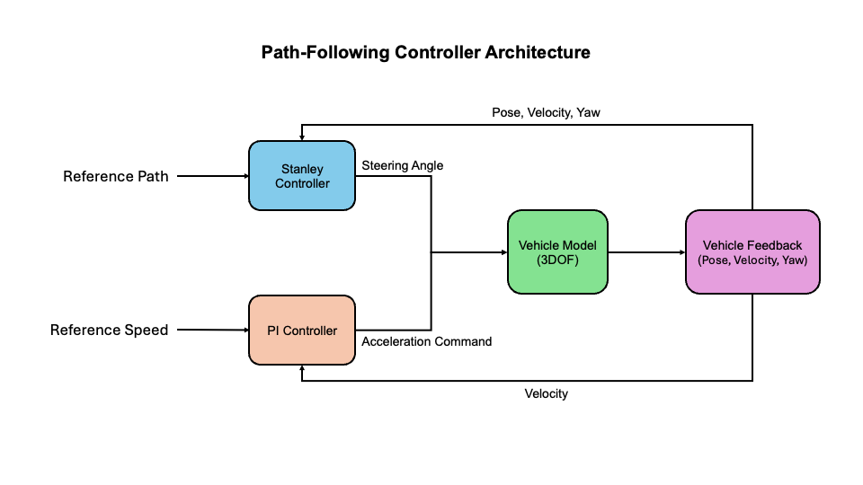
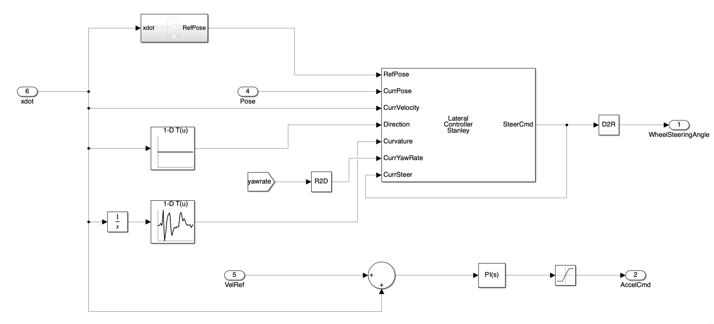
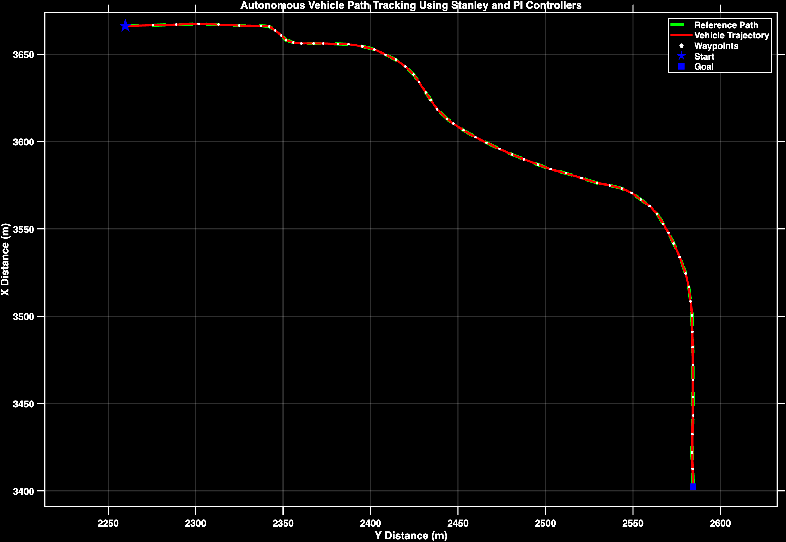

# Autonomous-Vehicle-Path-Following-Control

Implementation of Stanley lateral and PI longitudinal controllers for autonomous vehicle path-following using MATLAB/Simulink.

---

## Project Overview

This project presents the implementation of a path-following controller for an autonomous vehicle using MATLAB/Simulink. A Stanley controller was implemented for lateral path tracking, while a PI controller was implemented for longitudinal speed control. The controller was integrated into a provided vehicle simulation framework based on a 3DOF bicycle vehicle model and evaluated through trajectory tracking simulations.

---

## My Contribution

Within the provided MATLAB/Simulink vehicle simulation framework, my contributions included:

- Implementing the Stanley lateral controller
- Implementing the PI longitudinal controller
- Tuning controller parameters for stable path tracking
- Evaluating controller performance through simulation

---

## Features

- Stanley lateral path-following controller
- PI longitudinal speed controller
- Closed-loop autonomous vehicle path tracking
- MATLAB/Simulink implementation
- 3DOF bicycle vehicle dynamics model
- Trajectory tracking performance evaluation

---

## 🛠️ Technologies Used

| Technology | Purpose |
|------------|---------|
| MATLAB | Numerical computing and simulation |
| Simulink | Controller modeling and simulation |
| Stanley Controller | Lateral path tracking |
| PI Controller | Longitudinal speed control |
| 3DOF Bicycle Model | Vehicle dynamics simulation |

---

## Controller Architecture



**Figure 1:** Closed-loop path-following controller architecture using a Stanley lateral controller and a PI longitudinal controller.

---

## Controller Implementation

### Stanley Controller Subsystem



**Figure 2:** Simulink implementation of the Stanley lateral controller and PI longitudinal controller within the provided simulation framework.

### Overall Simulation Framework


**Figure 3:** Overall MATLAB/Simulink vehicle simulation framework integrating the controller, vehicle model, evaluation, and visualization components.

---

## Path Tracking Performance

The figure below compares the reference path with the vehicle trajectory generated by the implemented Stanley lateral controller and PI longitudinal controller. The close overlap between both trajectories demonstrates accurate path-following performance throughout the simulation.



**Figure 4:** Path-tracking performance of the implemented Stanley lateral controller and PI longitudinal controller. The simulated vehicle closely follows the reference path while successfully passing through the predefined waypoints.

---

## Project Workflow

1. Load the reference path and reference speed
2. Compute the lateral and longitudinal tracking errors
3. The Stanley controller computes the steering angle
4. The PI controller computes the acceleration command
5. The vehicle model updates the vehicle states
6. Vehicle feedback is used for continuous closed-loop path tracking

---

## Repository Structure

```text
.
├── images/
│   ├── controller_architecture.png
│   ├── stanley_controller_subsystem.png
│   ├── overall_simulation_framework.png
│   └── path_tracking_performance.png
├── LICENSE
└── README.md
```

---

## Challenges

- Implementing the Stanley controller within the provided framework
- Tuning Stanley and PI controller parameters
- Achieving stable trajectory tracking
- Achieving accurate trajectory tracking with minimal path-following error

---

## Academic Note

The vehicle simulation framework used in this project was provided as part of the course **Introduction to Autonomous Driving** at **Westsächsische Hochschule Zwickau (WHZ)**.

My contribution focused on implementing the Stanley lateral controller, the PI longitudinal controller, controller tuning, and performance evaluation. The original course materials, vehicle model, and complete Simulink framework are not included in this repository.
