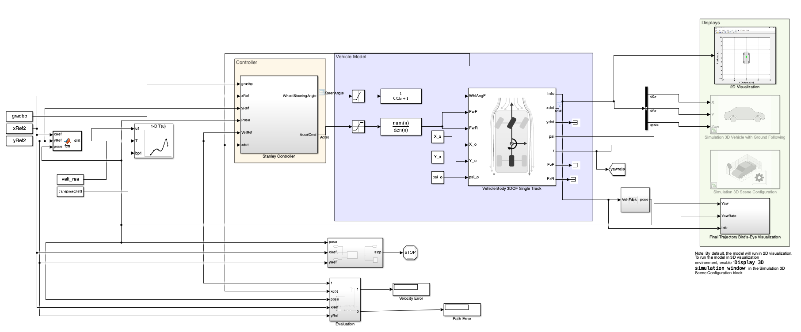

# Autonomous-Vehicle-Path-Following-Control
Implementation of Stanley lateral and PI longitudinal controllers for autonomous vehicle path-following using MATLAB/Simulink.

## Controller Architecture

**Figure 1:** Closed-loop path-following controller architecture using a Stanley lateral controller and a PI longitudinal controller.

## Controller Implementation

## Academic Note

The vehicle simulation framework used in this project was provided as part of the course **Introduction to Autonomous Driving** at Westsächsische Hochschule Zwickau.

My contribution focused on implementing the Stanley lateral controller, PI longitudinal controller, controller tuning, and performance evaluation. The original course materials and complete Simulink model are not included in this repository.
